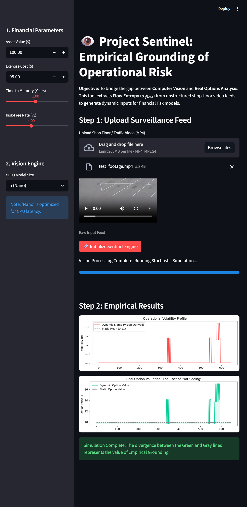

# 👁️ Project Sentinel: Empirical Grounding of Operational Risk

**Bridging the gap between Computer Vision and Real Options Analysis.**



## 🚀 Abstract
Traditional operational risk models often rely on static historical data. **Project Sentinel** introduces **Empirical Grounding**: analyzing live video feeds (shop floors, traffic) to extract **Flow Entropy** ($S$) and dynamically calibrate financial risk parameters.

It is not just object detection; it is **Financial Modeling based on Pixel Physics.**

## 💡 Key Features
* **Vision Engine:** YOLOv8 + Optical Flow tracks physical assets (People, Vehicles).
* **Entropy Calculation:** Converts kinematic chaos into a **Shannon Entropy** score ($\sigma_{flow}$).
* **Financial Model:** Feeds volatility into a **Black-Scholes Model** to price "Real Options" in real-time.
* **Interactive Dashboard:** Streamlit interface for live visualization.

## 📂 Included Assets
This repository includes validated test data in the `assets/` folder:
* **`test_footage.mp4`**: Industry-standard mixed traffic clip for calibration.
* **`demo_result.jpg`**: Validation output showing Volatility Spikes >25% during vehicle entry.

## ⚙️ Methodology
1.  **Ingestion:** Raw video feed is processed frame-by-frame.
2.  **Perception:** YOLOv8 identifies agents.
3.  **Quantification:** Visual Entropy is normalized to a Volatility Index ($\sigma$).
4.  **Valuation:** The Black-Scholes formula reprices the operational "Option" every second.

## 📦 Installation
*Prerequisites: Python 3.11*

```bash
# Clone
git clone [https://github.com/sandesh-s-hegde/project-sentinel.git](https://github.com/sandesh-s-hegde/project-sentinel.git)
cd project_sentinel

# Install (Windows Optimized)
py -m pip install --upgrade pip
py -m pip install "torch==2.5.1" "torchvision==0.20.1"
py -m pip install lapx
py -m pip install -r requirements.txt